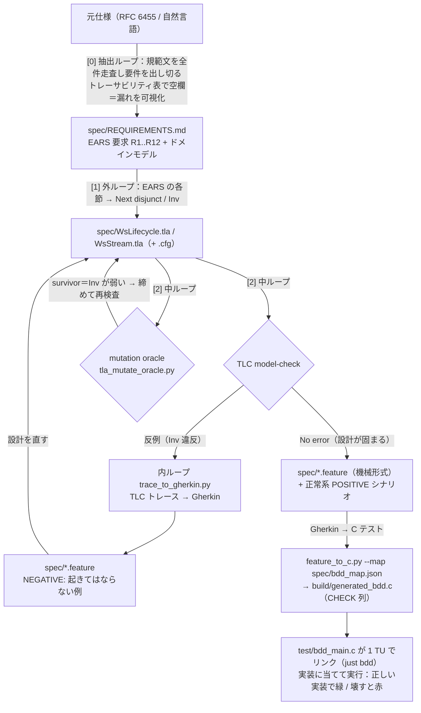

# 検証と健全性

このライブラリの正しさ・安全性をどう保証しているかをまとめる。
API の使い方は [`../README.md`](../README.md)、開発手順は [`development.md`](development.md) を参照。

## 三層検証

正しさを三つの層で担保する。
各層は別の道具で別の対象を保証し、機械変換では結線しない。

- **設計（TLA+、`spec/`）**：接続状態機械の安全性を網羅検査する。CONNECTING/OPEN/CLOSING/CLOSED の遷移と close ハンドシェイクが不変条件 INV1..INV6 を保つことを、有限状態空間の全探索で確かめる。
- **数学的核（Lean 4、`proofs/`）**：バイト列とビット演算レベルの性質 P1..P8 を証明する。マスキングが自己逆元であること（P1）、長さエンコードの往復と境界分類（P3/P4）、UTF-8 validator が accept する列が妥当な Unicode スカラ値であること（P8）などである。
- **実装（TDD）**：各性質を C のテストベクタへ落とし、先に失敗させてから実装をモデルに合わせる。UTF-8 の検証コードは Lean の `utf8DecodeStep` と分岐を1対1で対応させ、橋渡しテストで証明と実装を固定している。

## 検証フロー（要件 → 設計検証 → 受け入れ → テストコード）

ループエンジニアリングで、自然言語の仕様を段階的に厳密化し、最後に実装テストへ落とす。
各段の成果物（`spec/*.tla`・`spec/*.feature`・C テスト）はソースから再生成し、手編集しない。

実装の数学的核（マスキング・長さ・UTF-8 など）は別系統で **Lean 4（`proofs/`）** が証明し、
その述語をそのまま C テストのオラクルにする。全層は CI ゲート `just ci`（= `check` + `verify`）で常時強制する。

> 死角に注意：TLA+ はフレームのバイト中身を抽象化して捨てるため、RSV ビットや close code の値は
> TLA+ の検査範囲外（[0] のトレーサビリティ表で「要件が空欄」として拾う）。形式手法は抽出済みの
> 要件を厳密に検証するが、抽出そのものの網羅は [0] の責任。

## 検証が支える RFC 6455 セキュリティ性質

公開 API の各関数が、どの検証層でどのセキュリティ関連性質を保証しているか。

| 性質 | 関数 | 検証 |
|------|------|------|
| ペイロードのマスク/アンマスクが自己逆元（情報を欠落しない） | `ws_mask` | Lean P1/P2 |
| フレーム長エンコードの往復健全性・境界分類 | `ws_parse_header` / `ws_build_header` | Lean P3..P6 |
| opcode の data/control/reserved 分類の網羅性 | `ws_classify_opcode` | Lean P5 |
| close コードの送出可否判定（予約コードを弾く） | `ws_close_code_sendable` | Lean P7 |
| UTF-8 列の検証（不正な列を accept しない） | `ws_utf8_valid` | Lean P8 |
| 受信オーバーフローの拒否（固定長バッファを超えない） | `ws_conn_recv` | TLA+ SINV1 |
| フラグメント結合・close 処理の不変条件 | `ws_conn_poll` | TLA+ WsStream SINV1..8 |

## SINV8：違反時の組み立て破棄

`ws_conn_poll` の不変条件はすべて TLA+ で検査済み。とりわけ、プロトコル違反で
`failed` をラッチした瞬間に組み立て中メッセージを破棄する（SINV8）という設計判断は、
mutation テストが「破棄漏れ」を survivor として検出したことから導いた。

組み立て中のメッセージを違反後も保持し続けると、後続のバイト列と混ざって意図しない
メッセージが復元されうる。SINV8 はこの残留を禁じ、違反を検出した接続が以後 `ERROR` だけを
返すこと（フェイルクローズ）を不変条件として固定する。

## Gherkin による設計反例の実行可能化

上の「検証フロー」図の下半分（内ループ → `.feature` → C テスト）を詳述する。
TLA+ が見つけた設計レベルの反例トレースは、`trace_to_gherkin.py` で Gherkin の
受け入れシナリオに変換できる。freestanding/no-libc のこのプロジェクトでは、それを
`feature_to_c.py` が C の `CHECK` 列へ落とし、既存のテストハーネスにリンクして実装に当てる
（`just bdd <feature>`）。正しい実装で緑、状態機械が退行すると赤になるので、設計の保証が
実装まで配線されていることを確認できる。
